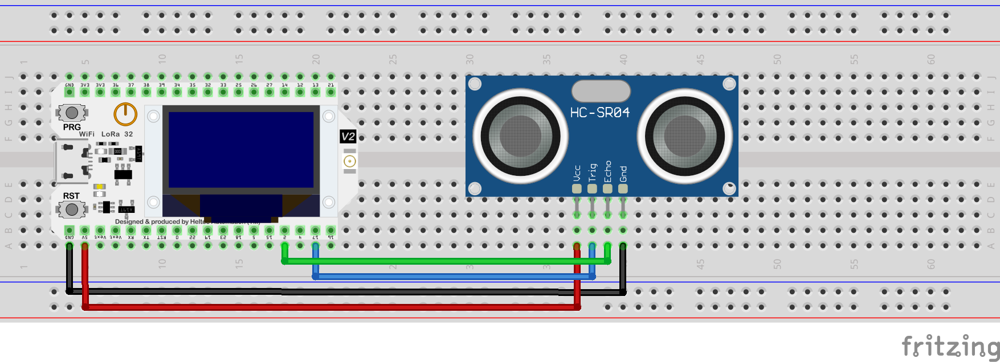

# Heltec ESP32 Lora V2 + Ultrasonic Sensor Sending Waterflow Data via MQTT

This project uses a [Heltec ESP32 Lora V2](https://heltec.org/project/wifi-lora-32v2/) and an HC-SR04 ultrasonic sensor to detect water flow in pipes to send updates on flow to an MQTT broker.  Note that while the board supports LoRa, this project does not use that functionality.  Instead, it connects to Wi-Fi and sends data via MQTT.  You can easily swap in any ESP32 board to make this work.

Further down, I include instructions for having the data get picked up by [Home Assistant](https://www.home-assistant.io/) via a Mosquitto MQTT broker. Home Assistant is a popular open-source home automation platform that can be used to control and automate smart home devices. Home Assistant can be configured to receive sensor data from the MQTT broker and display it in the user interface.

## Prerequisites

1. [Heltec ESP32 Lora V2](https://heltec.org/project/wifi-lora-32v2/)
1. [PlatformIO](https://platformio.org/) installed in [Visual Studio Code](https://code.visualstudio.com/)

## Setup

### Hardware Setup
1. Connect the HC-SR04 ultrasonic sensor to the Heltec ESP32 Lora V2 board as follows:
   - VCC to 5V
   - GND to GND
   - TRIG to GPIO 17
   - ECHO to GPIO 2

   [](./images/Sketch.png)

### Software Setup
1. Clone this repository to your local machine.
1. Open Visual Studio Code to the project directory.
1. Rename [./platformio.sample.ini](./platformio.sample.ini) to `platformio.ini`.
1. Update the `platformio.ini` file with your Wi-Fi network credentials and MQTT broker information.
1. Build and upload the project to the Heltec device.


### Understanding the details!

1. When the device connects to Wifi, it will display the SSID and IP address on the OLED screen.
2. When every X seconds, the data from the ultrasonic sensor will be read.  When water is detected, the value will be greater than 0.
3. If it detects a change in the water flow, it will send the data to the MQTT broker.  The data will be sent in JSON format with the following structure:
```json
{
  "WaterFlow": true/false
}
```
4. The device will also display the water flow status on the OLED screen.
5. When a message is sent successfully, the built in LED will blink once.

## Home Assistant Setup

1. [Home Assistant](https://www.home-assistant.io/) installed on a Raspberry Pi or other device.
1. An MQTT broker such as [Mosquitto](https://mosquitto.org/) installed and [Home Assistant](https://www.home-assistant.io/integrations/mqtt#setting-up-a-broker) connected to it.
1. Add the following configuration to your `configuration.yaml` file. This will create two sensors in Home Assistant that will receive the sensor data from the MXChip device.  Repeast as needed for multiple boards.

```yaml
mqtt:
  sensor:
    - name: "Water Flow"
      state_topic: "WaterFlow"
      value_template: "{{ value_json.WaterFlow }}"
```